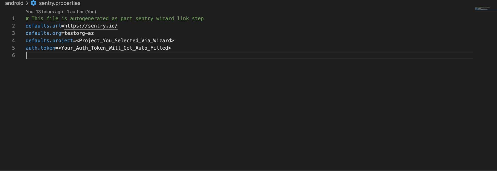
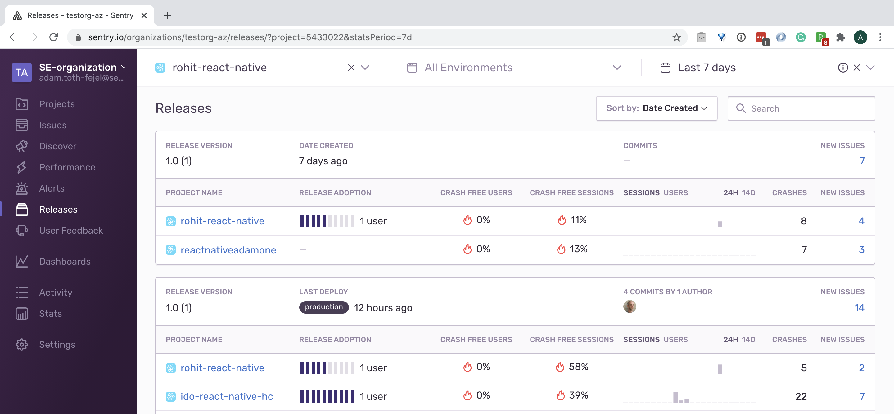

# sentry-demos/react-native
https://docs.sentry.io/clients/react-native/
## Versions Summary:
| dependency      | version
| ------------- |:-------------:|
| node      | 14.4.0  |
| sentry-cli   | 1.55.2    |
| macOS | Catalina 10.15.4      |
## Goal/Summary:
Show how Sentry works on React Native
- Show Javascript errors that can be captured
- Showcase native Java errors on Android
- Showcase native iOS errors
- Showcase Release Health

## Setup

# Prequisite Reading
General [React Native ENV Setup](https://reactnative.dev/docs/environment-setup)

Since the content on the above page may change or the link breaks, below are the respective versions of the tools for which this demo has been tested to work.

# Platform

## MacBook Pro (13-inch, 2020)
 MacOS Catalina
 10.15.5 (19F101)

# Software
## Xcode
```Launch Xcode --> About  --> Version 12.0 (12A7209)```

## Android Studio
```Launch Android Studio --> About --> 4.0.1```


## In your Terminal:

### xcode command line tools
```
$xcode-select install
$xcode-select --version
xcode-select version 2373.
```

### Node
```
$brew install node
$node -v
v14.4.0
```

### Watchman
```
$brew install watchman
$watchman --version
4.9.0
```

### Cocoapods
```
$sudo gem install cocoapods
$pod --version
1.9.3
```

### Java
```
$java --version
openjdk version "1.8.0_242-release"
OpenJDK Runtime Environment (build 1.8.0_242-release-1644-b3-6222593)
OpenJDK 64-Bit Server VM (build 25.242-b3-6222593, mixed mode)
```

1. Install dependencies listed under https://facebook.github.io/react-native/docs/getting-started.html#node-watchman-jdk (all except for node):
```
brew install watchman
brew tap AdoptOpenJDK/openjdk
brew cask install adoptopenjdk8
```
2. Install cocoapods (`gem install cocoapods`)
3. Install packages: `npm install`
4. Make sure `SENTRY_AUTH_TOKEN` environment variable is set (https://docs.sentry.io/cli/configuration/#to-authenticate-manually)
5. Make sure DSN key is set in App.js

# Change project
1. Replace DSN in App.js
2. Replace org and project in ios/sentry.properties + android/sentry.properties.



# Run

### iOS:
```
$ npx react-native run-ios --configuration Release
```
### Android
```

npx react-native run-android --variant Release
```


### Gotchas
1. Make sure to always be using the latest version of node, it can solve a lot of problems.

2.  If you get an error when trying to run the following command: *react-native run-ios --configuration Release* that looks like this *"...options^^^ SyntaxError: Unexpected token ..."*, there is a chance that XCode is using it's own version of node.  You will have to go to your root directory i.e. /Users/adamtoth-fejel and temporarily change the name of .nvm/
directory to something like oldnvm to force Xcode to use the latest version of node being used within your project.  Following this, in your project you should make sure you are once again using the latest version of node via *nvm ls* and do *nvm use v14.4.0*.   Once you do this, you should be able to change the directory name back to .nvm in the
home directory and XCode should now be using the local version of node within your project.

3.  If you see an error like this: error: *The linked library 'libPods-sentry_react_native.a' is missing one or more architectures required by this target: arm64. (in target 'sentry_react_native' from project 'sentry_react_native')*.
To fix this issue, you will have to comment out


# GIF (JS error)


# Release Health


# Native crash

