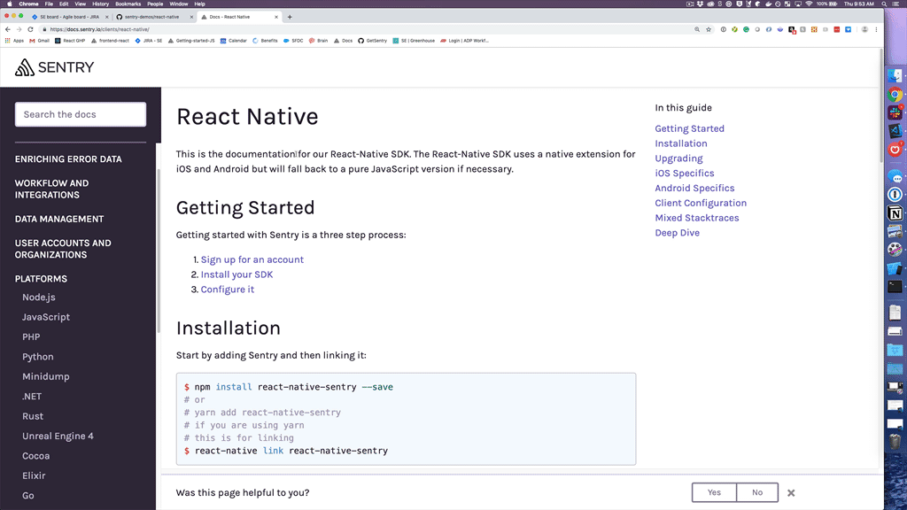
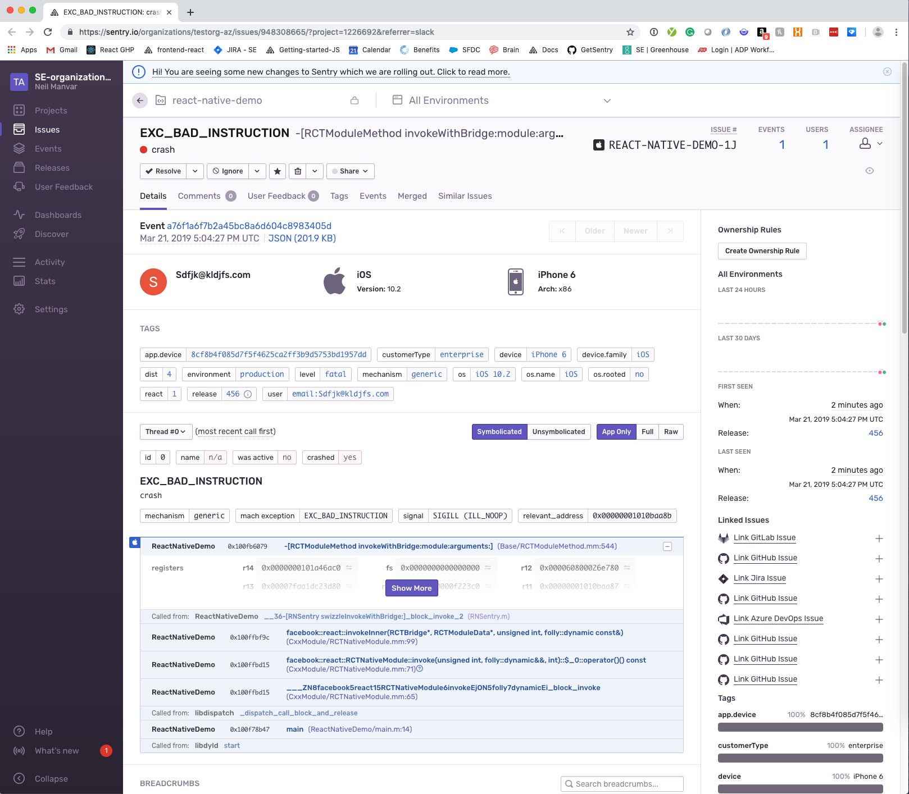

# sentry-demos/react-native

https://docs.sentry.io/clients/react-native/

## Goal/Summary:
Show how Sentry works to surface errors in react-native applications (stacktraces will be symbolicated + unminified)

## First-time Setup
this project uses:  
React Native v0.59.10  
react-native-sentry ^0.43.2  
react-native-cli: 2.0.1  

0. create a React Native project on Sentry.io (the `link` command below will have you select your RN project)
1. cd ReactNativeDemo
2. Install dependencies
```
npm install -g react-native-cli
npm install && yarn install
```
3. `react-native link react-native-sentry`
updates the following:
modified:   android/app/build.gradle
       modified:   android/app/src/main/java/com/reactnativedemo/MainApplication.java
       modified:   android/settings.gradle
       modified:   ios/ReactNativeDemo.xcodeproj/project.pbxproj
       modified:   ios/ReactNativeDemo/AppDelegate.m
       modified:   ios/sentry.properties
       modified:   package-lock.json
       modified:   yarn.lock
       modified:   App.js
4. Run it
ios
```
$ react-native run-ios --configuration Release
```
android
```
$ react-native run-android --variant
```

5. Simulator/Emulator should have launched with sample app. Trigger errors and go to Sentry to see them!

# GIF (JS error)


# Native crash

